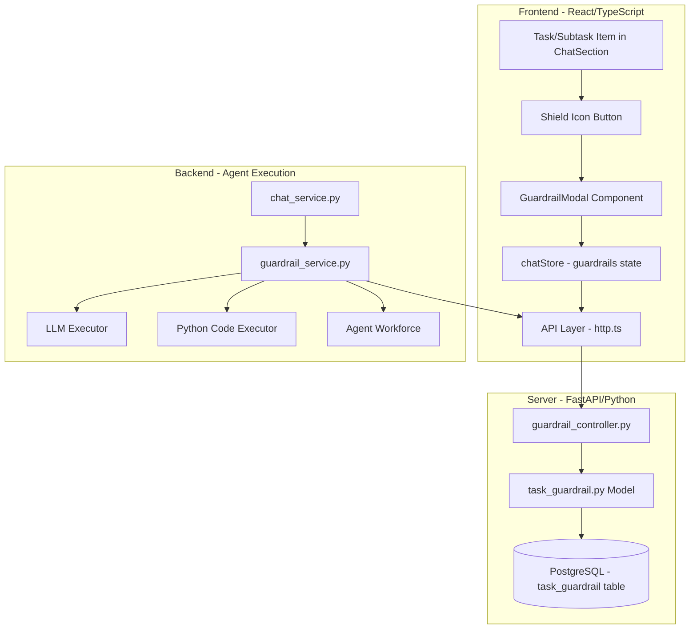
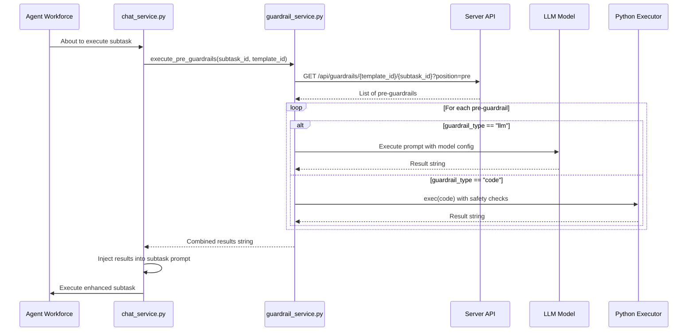
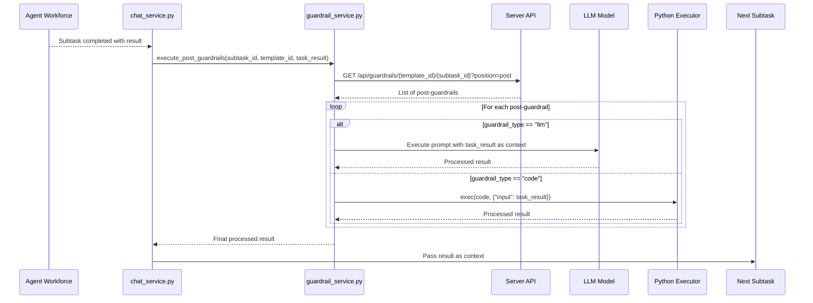

# Guardrails Feature - Detailed Implementation Plan

## Overview

Implement a comprehensive Guardrails system that allows users to define pre-subtask and post-task validation/transformation rules. Guardrails can be LLM-based (prompt execution) or Code-based (Python execution), with results injected into task prompts or passed to subsequent tasks. Guardrails are stored at the template level for reuse across re-executions.

---

## System Architecture



---

## Detailed Execution Flow

### Pre-Guardrail Flow (Before Subtask Execution)



### Post-Guardrail Flow (After Subtask Completion)



---

## Database Schema

### New Table: `task_guardrail`

```sql
CREATE TABLE task_guardrail (
    id SERIAL PRIMARY KEY,
    user_id INTEGER NOT NULL REFERENCES user(id),
    template_id INTEGER NOT NULL REFERENCES workflow_template(id),
    subtask_id VARCHAR(64) NOT NULL,  -- e.g., "task-1.0", "task-1.1"
    subtask_content TEXT,              -- Store subtask description for reference
    position VARCHAR(10) NOT NULL,     -- 'pre' or 'post'
    guardrail_type VARCHAR(10) NOT NULL, -- 'llm' or 'code'
    content TEXT NOT NULL,             -- Prompt text or Python code
    model_platform VARCHAR(32),        -- e.g., 'openai', 'anthropic' (nullable for code type)
    model_type VARCHAR(64),            -- e.g., 'gpt-4', 'claude-3' (nullable for code type)
    is_enabled BOOLEAN DEFAULT TRUE,
    execution_order INTEGER DEFAULT 0, -- For multiple guardrails on same subtask
    created_at TIMESTAMP DEFAULT NOW(),
    updated_at TIMESTAMP DEFAULT NOW(),
    
    INDEX idx_guardrail_template (template_id),
    INDEX idx_guardrail_subtask (template_id, subtask_id),
    UNIQUE (template_id, subtask_id, position, execution_order)
);
```

---

## Component Details

### 1. Database Model - `server/app/model/chat/task_guardrail.py`

```python
from sqlmodel import Field, Column, Text
from app.model.abstract.model import AbstractModel, DefaultTimes
from pydantic import BaseModel
from typing import Optional, Literal

class TaskGuardrail(AbstractModel, DefaultTimes, table=True):
    """Stores guardrail definitions for subtasks in workflow templates."""
    __tablename__ = "task_guardrail"
    
    id: int = Field(default=None, primary_key=True)
    user_id: int = Field(index=True)
    template_id: int = Field(index=True)
    subtask_id: str = Field(max_length=64, index=True)
    subtask_content: Optional[str] = Field(default=None, sa_column=Column(Text))
    position: str = Field(max_length=10)  # 'pre' or 'post'
    guardrail_type: str = Field(max_length=10)  # 'llm' or 'code'
    content: str = Field(sa_column=Column(Text))  # Prompt or Python code
    model_platform: Optional[str] = Field(default=None, max_length=32)
    model_type: Optional[str] = Field(default=None, max_length=64)
    is_enabled: bool = Field(default=True)
    execution_order: int = Field(default=0)

class GuardrailIn(BaseModel):
    template_id: int
    subtask_id: str
    subtask_content: Optional[str] = None
    position: Literal['pre', 'post']
    guardrail_type: Literal['llm', 'code']
    content: str
    model_platform: Optional[str] = None
    model_type: Optional[str] = None
    is_enabled: bool = True
    execution_order: int = 0

class GuardrailOut(BaseModel):
    id: int
    template_id: int
    subtask_id: str
    subtask_content: Optional[str]
    position: str
    guardrail_type: str
    content: str
    model_platform: Optional[str]
    model_type: Optional[str]
    is_enabled: bool
    execution_order: int
    
    class Config:
        from_attributes = True
```

### 2. Server API Controller - `server/app/controller/chat/guardrail_controller.py`

```python
from fastapi import APIRouter, Depends, HTTPException
from sqlmodel import Session, select
from app.model.chat.task_guardrail import TaskGuardrail, GuardrailIn, GuardrailOut
from app.component.auth import Auth, auth_must
from app.component.db import session

router = APIRouter(prefix="/api/chat", tags=["Guardrails"])

@router.post("/guardrails", response_model=GuardrailOut)
async def create_guardrail(data: GuardrailIn, session: Session, auth: Auth):
    """Create a new guardrail for a subtask."""
    
@router.get("/guardrails/{template_id}")
async def list_guardrails(template_id: int, session: Session, auth: Auth):
    """List all guardrails for a template."""
    
@router.get("/guardrails/{template_id}/{subtask_id}")
async def get_subtask_guardrails(template_id: int, subtask_id: str, 
                                  position: str = None, session: Session, auth: Auth):
    """Get guardrails for a specific subtask, optionally filtered by position."""
    
@router.put("/guardrails/{guardrail_id}", response_model=GuardrailOut)
async def update_guardrail(guardrail_id: int, data: GuardrailIn, session: Session, auth: Auth):
    """Update an existing guardrail."""
    
@router.delete("/guardrails/{guardrail_id}")
async def delete_guardrail(guardrail_id: int, session: Session, auth: Auth):
    """Delete a guardrail."""
```

### 3. Backend Execution Service - `backend/app/service/guardrail_service.py`

```python
from typing import Optional, List, Dict, Any
from loguru import logger
from app.model.chat import Chat
import httpx

class GuardrailService:
    """Handles execution of pre and post guardrails during task execution."""
    
    def __init__(self, options: Chat, server_url: str = "http://localhost:3001"):
        self.options = options
        self.server_url = server_url
        self.auth_token = options.auth_token
        
    async def execute_pre_guardrails(
        self, 
        subtask_id: str, 
        template_id: int
    ) -> Optional[str]:
        """
        Execute all pre-guardrails for a subtask.
        Returns combined result string to inject into subtask prompt.
        """
        guardrails = await self._fetch_guardrails(template_id, subtask_id, "pre")
        if not guardrails:
            return None
            
        results = []
        for guard in guardrails:
            if not guard.get("is_enabled"):
                continue
            result = await self._execute_single_guardrail(guard)
            if result:
                results.append(result)
                
        return "\n\n".join(results) if results else None
        
    async def execute_post_guardrails(
        self,
        subtask_id: str,
        template_id: int,
        task_result: str
    ) -> Optional[str]:
        """
        Execute all post-guardrails for a subtask.
        Returns processed result to pass to next task.
        """
        guardrails = await self._fetch_guardrails(template_id, subtask_id, "post")
        if not guardrails:
            return task_result
            
        current_result = task_result
        for guard in guardrails:
            if not guard.get("is_enabled"):
                continue
            current_result = await self._execute_single_guardrail(
                guard, input_data=current_result
            )
            
        return current_result
        
    async def _execute_single_guardrail(
        self, 
        guardrail: Dict[str, Any],
        input_data: Optional[str] = None
    ) -> Optional[str]:
        """Execute a single guardrail (LLM or Code)."""
        if guardrail["guardrail_type"] == "llm":
            return await self._execute_llm_guardrail(
                prompt=guardrail["content"],
                model_platform=guardrail.get("model_platform"),
                model_type=guardrail.get("model_type"),
                input_data=input_data
            )
        else:  # code
            return self._execute_code_guardrail(
                code=guardrail["content"],
                input_data=input_data
            )
            
    async def _execute_llm_guardrail(
        self,
        prompt: str,
        model_platform: Optional[str],
        model_type: Optional[str],
        input_data: Optional[str] = None
    ) -> str:
        """Execute LLM-based guardrail."""
        # Use provided model or fall back to task's model
        platform = model_platform or self.options.model_platform
        model = model_type or self.options.model_type
        
        # Build prompt with input if post-guardrail
        full_prompt = prompt
        if input_data:
            full_prompt = f"{prompt}\n\nInput from previous task:\n{input_data}"
            
        # Execute using agent_model pattern
        from app.utils.agent import agent_model
        agent = agent_model(
            agent_name="guardrail_executor",
            system_message="Execute the guardrail and return only the result string.",
            options=self.options
        )
        response = await agent.astep(full_prompt)
        return response.msg.content if response.msg else ""
        
    def _execute_code_guardrail(
        self,
        code: str,
        input_data: Optional[str] = None
    ) -> str:
        """Execute Python code guardrail with safety restrictions."""
        # Create restricted execution environment
        safe_globals = {
            "__builtins__": {
                "len": len, "str": str, "int": int, "float": float,
                "list": list, "dict": dict, "bool": bool,
                "print": print, "range": range, "enumerate": enumerate,
                "zip": zip, "map": map, "filter": filter,
                "sum": sum, "min": min, "max": max, "sorted": sorted,
                "json": __import__("json"),
                "re": __import__("re"),
                "datetime": __import__("datetime"),
            }
        }
        local_vars = {"input": input_data, "result": None}
        
        try:
            exec(code, safe_globals, local_vars)
            return str(local_vars.get("result", ""))
        except Exception as e:
            logger.error(f"Guardrail code execution failed: {e}")
            return f"Error: {str(e)}"
```

### 4. Frontend Modal Component - `src/components/GuardrailModal.tsx`

```tsx
// Key component structure
interface GuardrailModalProps {
  open: boolean;
  onClose: () => void;
  templateId: number;
  subtaskId: string;
  subtaskContent: string;
}

export function GuardrailModal({ open, onClose, templateId, subtaskId, subtaskContent }: GuardrailModalProps) {
  const [activeTab, setActiveTab] = useState<'pre' | 'post'>('pre');
  const [guardrailType, setGuardrailType] = useState<'llm' | 'code'>('llm');
  const [content, setContent] = useState('');
  const [modelPlatform, setModelPlatform] = useState('');
  const [modelType, setModelType] = useState('');
  const [guardrails, setGuardrails] = useState<Guardrail[]>([]);
  
  // Fetch existing guardrails on mount
  // CRUD operations for guardrails
  // Render tabs for Pre/Post, type toggle, content editor
}
```

### 5. UI Integration Points

**File: `src/components/ChatSection/index.tsx`** - Add guardrail icon to subtask items (around line 540-562):

```tsx
// Inside the subtask item render, add Shield icon next to Edit/Delete buttons
{task.status === 'pending' && (
  <div className="flex justify-center flex-col gap-3">
    {/* NEW: Guardrail button */}
    <button
      onClick={(e) => {
        e.stopPropagation();
        setGuardrailModalSubtask(subtask);
        setGuardrailModalOpen(true);
      }}
      className={`flex-shrink-0 p-1 h-fit hover:bg-purple-50 rounded transition-colors ${
        subtask.hasGuardrails ? 'text-purple-600' : 'text-gray-400'
      }`}
      title="Configure guardrails"
    >
      <Shield className="block" size={14} strokeWidth={1.5} />
    </button>
    {/* Existing Edit button */}
    <button onClick={...}>
      <Pencil ... />
    </button>
    {/* Existing Delete button */}
    <button onClick={...}>
      <X ... />
    </button>
  </div>
)}
```

---

## UI Component Design

### GuardrailModal Layout

```
┌─────────────────────────────────────────────────────────────────┐
│  Configure Guardrails                                      [X]  │
├─────────────────────────────────────────────────────────────────┤
│  Subtask: "Research market trends for AI products"              │
├─────────────────────────────────────────────────────────────────┤
│  ┌──────────────┐ ┌──────────────┐                              │
│  │ Pre-Subtask  │ │ Post-Task    │  <- Tabs                     │
│  └──────────────┘ └──────────────┘                              │
├─────────────────────────────────────────────────────────────────┤
│  Type:  (●) LLM Based    ( ) Code Based                         │
├─────────────────────────────────────────────────────────────────┤
│  [Only for LLM type]                                            │
│  Model: [OpenAI      ▼] [gpt-4-turbo    ▼]                     │
├─────────────────────────────────────────────────────────────────┤
│  ┌───────────────────────────────────────────────────────────┐  │
│  │ Enter your prompt or Python code here...                  │  │
│  │                                                           │  │
│  │ For LLM: Write the prompt to execute                      │  │
│  │ For Code: Write Python code that sets 'result' variable   │  │
│  │                                                           │  │
│  │ Example (Code):                                           │  │
│  │ # input contains the previous task result                 │  │
│  │ result = input.upper() if input else "No input"           │  │
│  │                                                           │  │
│  └───────────────────────────────────────────────────────────┘  │
├─────────────────────────────────────────────────────────────────┤
│  Existing Guardrails:                                           │
│  ┌─────────────────────────────────────────────────────────────┐│
│  │ 🤖 LLM Pre-Guardrail: "Validate input format..."   [Edit][X]││
│  │ 🐍 Code Post-Guardrail: "Transform result..."      [Edit][X]││
│  └─────────────────────────────────────────────────────────────┘│
├─────────────────────────────────────────────────────────────────┤
│                              [Cancel]  [Save Guardrail]         │
└─────────────────────────────────────────────────────────────────┘
```

---

## Integration with Task Execution

### Modified `chat_service.py` Flow

```python
# In step_solve function, around line 220-230 where tasks are processed:

# Before processing each subtask action
elif item.action == Action.assign_task:
    subtask_id = item.data.get("task_id")
    
    # Execute pre-guardrails if in template mode
    if options.template_mode and options.template_id:
        guardrail_service = GuardrailService(options)
        pre_result = await guardrail_service.execute_pre_guardrails(
            subtask_id, options.template_id
        )
        if pre_result:
            # Inject pre-guardrail result into task context
            item.data["enhanced_context"] = pre_result
            
    yield sse_json("assign_task", item.data)

# After task completion (in deactivate_agent handling)
elif item.action == Action.deactivate_agent:
    subtask_id = item.data.get("task_id")
    task_result = item.data.get("result")
    
    # Execute post-guardrails if in template mode
    if options.template_mode and options.template_id:
        guardrail_service = GuardrailService(options)
        post_result = await guardrail_service.execute_post_guardrails(
            subtask_id, options.template_id, task_result
        )
        item.data["processed_result"] = post_result
        
    yield sse_json("deactivate_agent", dict(item.data))
```

---

## Files to Create/Modify Summary

| File | Action | Description |

|------|--------|-------------|

| [`server/app/model/chat/task_guardrail.py`](server/app/model/chat/task_guardrail.py) | **Create** | SQLModel definition with Pydantic schemas |

| [`server/alembic/versions/2025_xx_xx_add_guardrails.py`](server/alembic/versions/) | **Create** | Database migration |

| [`server/app/controller/chat/guardrail_controller.py`](server/app/controller/chat/guardrail_controller.py) | **Create** | REST API endpoints |

| [`backend/app/service/guardrail_service.py`](backend/app/service/guardrail_service.py) | **Create** | Guardrail execution logic |

| [`backend/app/service/chat_service.py`](backend/app/service/chat_service.py) | **Modify** | Integrate guardrail calls |

| [`src/components/GuardrailModal.tsx`](src/components/GuardrailModal.tsx) | **Create** | UI modal component |

| [`src/components/ChatSection/index.tsx`](src/components/ChatSection/index.tsx) | **Modify** | Add Shield icon to subtasks |

| [`src/api/http.ts`](src/api/http.ts) | **Modify** | Add guardrail API functions |

---

## Implementation Order

1. **Database Layer** - Model + Migration
2. **Server API** - Controller with CRUD
3. **Backend Service** - Execution logic
4. **Frontend Modal** - UI component
5. **UI Integration** - Add icons to subtasks
6. **Task Integration** - Wire into chat_service.py
7. **Testing** - End-to-end flow validation
