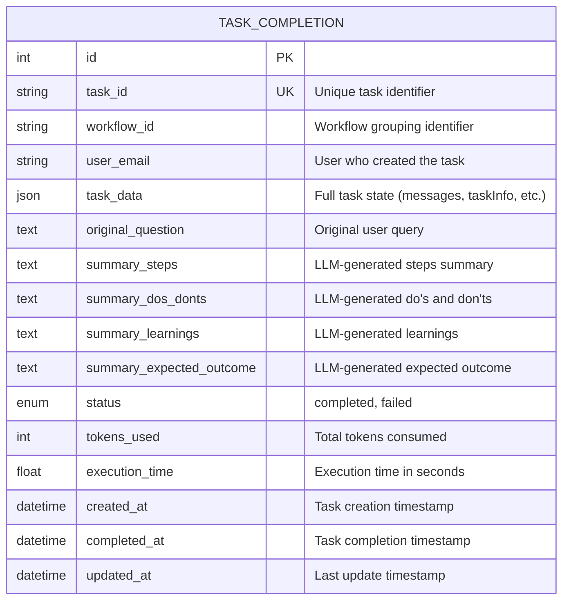

# Database Schema Diagram

## Entity Relationship Diagram



## Table Structure

### `task_completion` Table

| Column Name | Data Type | Constraints | Description |
|------------|-----------|-------------|-------------|
| `id` | INTEGER | PRIMARY KEY, AUTO_INCREMENT | Unique record identifier |
| `task_id` | VARCHAR(255) | UNIQUE, NOT NULL, INDEXED | Unique task identifier (e.g., "1759763102880-5009") |
| `workflow_id` | VARCHAR(255) | NOT NULL, INDEXED | Workflow identifier for grouping related tasks |
| `user_email` | VARCHAR(255) | NOT NULL, INDEXED | Email of user who created the task |
| `task_data` | JSON | NOT NULL | Complete task state including:<br>- messages (array)<br>- taskInfo (array)<br>- taskRunning (array)<br>- taskAssigning (array)<br>- fileList (array)<br>- webViewUrls (array)<br>- snapshots (array)<br>- All other task properties |
| `original_question` | TEXT | NOT NULL | Original user query/question |
| `summary_steps` | TEXT | NULL | LLM-generated summary of all execution steps |
| `summary_dos_donts` | TEXT | NULL | LLM-generated list of do's and don'ts |
| `summary_learnings` | TEXT | NULL | LLM-generated key learnings and insights |
| `summary_expected_outcome` | TEXT | NULL | LLM-generated description of expected vs actual outcome |
| `status` | ENUM | NOT NULL, DEFAULT 'completed' | Task completion status: 'completed' or 'failed' |
| `tokens_used` | INTEGER | DEFAULT 0 | Total tokens consumed during task execution |
| `execution_time` | FLOAT | DEFAULT 0.0 | Task execution time in seconds |
| `created_at` | TIMESTAMP | NOT NULL, DEFAULT CURRENT_TIMESTAMP | When task was created |
| `completed_at` | TIMESTAMP | NULL | When task was completed |
| `updated_at` | TIMESTAMP | NOT NULL, DEFAULT CURRENT_TIMESTAMP, ON UPDATE CURRENT_TIMESTAMP | Last update timestamp |

## Indexes

1. **Primary Key**: `id`
2. **Unique Index**: `task_id` (ensures each task is saved only once)
3. **Index**: `workflow_id` (for fast retrieval of all tasks in a workflow)
4. **Index**: `user_email` (for user-specific queries)
5. **Index**: `completed_at` (for time-based queries and sorting)

## Relationships

- **Self-referential**: Tasks can be grouped by `workflow_id` to retrieve knowledge from previous executions
- **User association**: Tasks are associated with users via `user_email`

## JSON Structure (task_data field)

The `task_data` JSON field contains the complete task state:

```json
{
  "messages": [
    {
      "id": "string",
      "role": "user|agent",
      "content": "string",
      "step": "string",
      "fileList": [],
      "timestamp": "datetime"
    }
  ],
  "taskInfo": [
    {
      "id": "string",
      "content": "string",
      "status": "pending|completed|failed",
      "report": "string"
    }
  ],
  "taskRunning": [
    {
      "id": "string",
      "content": "string",
      "status": "string"
    }
  ],
  "taskAssigning": [
    {
      "agent_id": "string",
      "name": "string",
      "type": "string",
      "tasks": [],
      "log": [],
      "activeWebviewIds": []
    }
  ],
  "fileList": [],
  "webViewUrls": [],
  "snapshots": [],
  "summaryTask": "string",
  "status": "running|finished|pending|pause",
  "tokens": 0,
  "elapsed": 0,
  "progressValue": 0,
  "activeWorkSpace": null,
  "activeAgent": "string"
}
```

## Query Patterns

### 1. Retrieve task by task_id
```sql
SELECT * FROM task_completion WHERE task_id = ?;
```

### 2. Retrieve all tasks for a workflow
```sql
SELECT * FROM task_completion 
WHERE workflow_id = ? 
ORDER BY completed_at DESC;
```

### 3. Retrieve knowledge summaries for a workflow
```sql
SELECT 
  task_id,
  original_question,
  summary_steps,
  summary_dos_donts,
  summary_learnings,
  summary_expected_outcome,
  completed_at
FROM task_completion 
WHERE workflow_id = ? 
  AND status = 'completed'
  AND summary_steps IS NOT NULL
ORDER BY completed_at DESC
LIMIT 10;
```

### 4. Find similar tasks by question similarity
```sql
SELECT 
  task_id,
  workflow_id,
  original_question,
  summary_steps,
  summary_dos_donts,
  summary_learnings
FROM task_completion 
WHERE workflow_id = ?
  AND status = 'completed'
ORDER BY completed_at DESC;
```

## Data Flow

```
Task Execution
    ↓
Task Completes (Action.end)
    ↓
Extract Full Task State
    ↓
Save to task_completion table (task_data JSON)
    ↓
Trigger LLM Summarization
    ↓
Update task_completion with summaries:
  - summary_steps
  - summary_dos_donts
  - summary_learnings
  - summary_expected_outcome
    ↓
Available for Future Workflow Retrieval
```

## Best Practices

1. **Unique Constraint**: `task_id` ensures no duplicate saves
2. **Indexing**: Strategic indexes on `workflow_id`, `user_email`, and `completed_at` for fast queries
3. **JSON Storage**: Flexible storage for complex nested task state
4. **Nullable Summaries**: Summaries are nullable initially, populated after LLM processing
5. **Timestamps**: Track creation, completion, and updates for audit trail
6. **Status Tracking**: Enum for clear status management
7. **Token Tracking**: Store token usage for cost analysis
8. **Execution Time**: Track performance metrics

